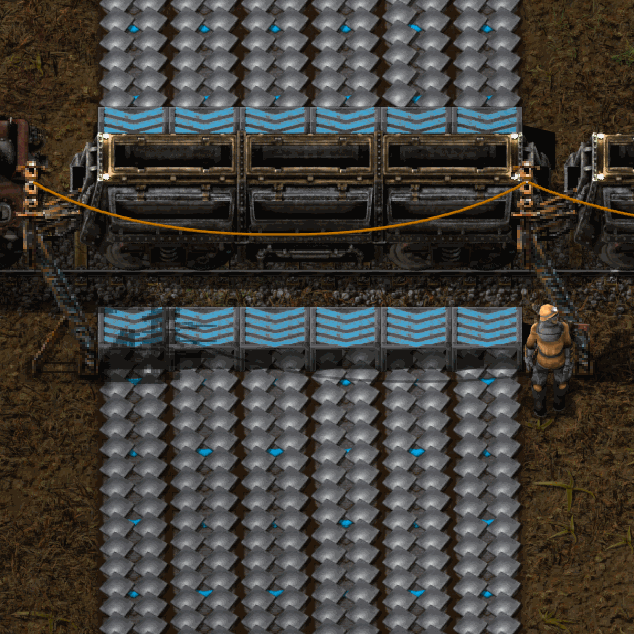
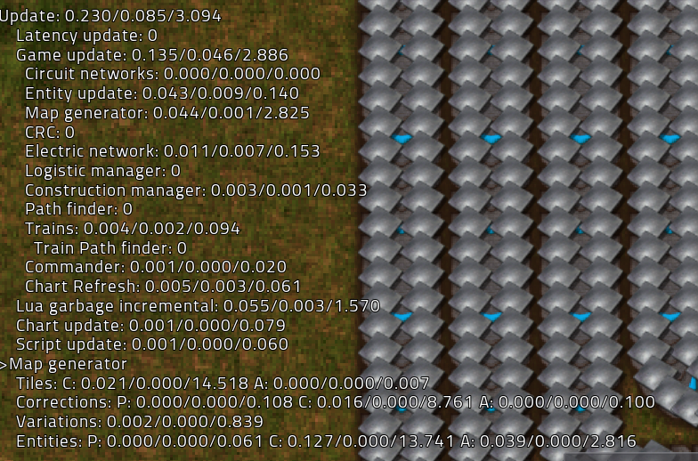
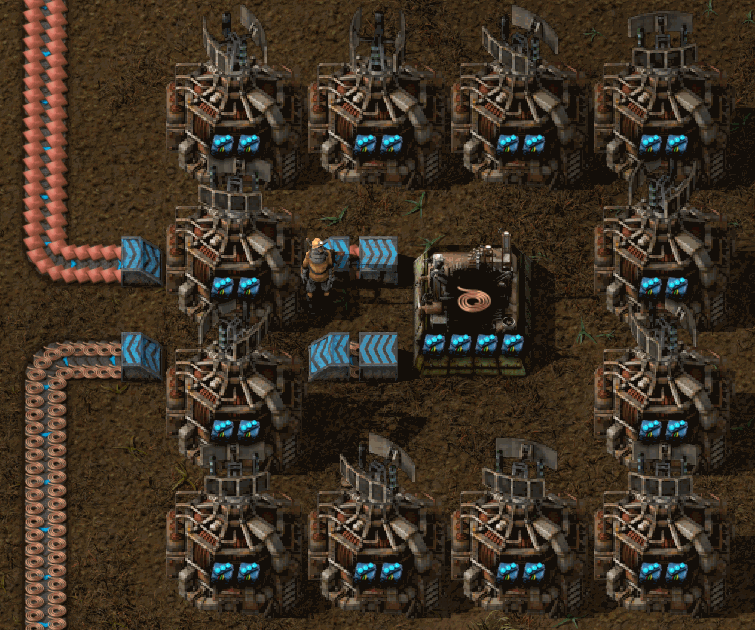
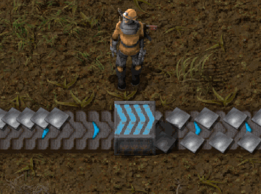

# Miniloaders

This mod introduces miniloaders, 1x1 entities that efficiently transfer a full
belt worth of items into and out of containers, including train cargo wagons.

They use no Lua when running, keeping your factory's UPS healthy.

You can use them to feed your high-speed assemblers,

or put them in your bus as single-belt lane rebalancers.

Faster modded belts from Bob's Logistics, FactorioExtended Plus, and Space
Exploration are fully supported, with partial support for Ultimate Belts.

## Videos and Spotlights

Xterminator has [spotlighted Miniloader](https://youtu.be/6aGD3fh2P5A).
Seeeno has created a
[video tutorial in German](https://www.youtube.com/watch?v=f16zRTtZSQA) for Miniloader.

## Balancing

Miniloaders require stack inserter research, are relatively expensive to build,
and consume approximately the power of two fully-upgraded stack inserters.

## How it works

Each miniloader hides a set of very fast invisible inserters, one for each lane
of the belt.  Lua scripting adjusts pickup and drop points accordingly when the
direction of the miniloader is changed.

Since item movement is handled by inserters, there is no on_tick handler, no Lua
impact on UPS, and miniloaders will benefit from any future improvements to belt
and inserter performance made by Wube in the Factorio core.

## Filtering

Versions of miniloaders with and without filtering are available once the
appropriate technology has been researched.  As you would expect, to build a
miniloader capable of filtering, you must use filter inserters as ingredients.

Note that filter miniloaders behave like filter inserters, and not like vanilla
loaders: if no filters are set then no items will be moved. You must set at
least one filter.

## Known Issues

* The power usage UI counts each miniloader multiple times, since it shows the
  power used by the inserters, not the miniloaders themselves.
* Miniloaders cannot be fast-replaced due to the invisible entities blocking
  placement of the new entity.
* Miniloader arrows don't always appear correctly in blueprints.

## Ultimate Belts Caveats and Warnings

__Ultimate Belts support is in BETA state.__

Factorio core engine limitations restrict inserters pulling from belts to
60 items/second, or 4.5x yellow belt speed. Further, loader entities are
restricted to 120 items/second.

Miniloaders at "Ultra fast" and faster speeds use vanilla loader entities in
addition to inserters, giving a max throughput of ~180 items/second when
interacting with chests and other containers. They will _not_ give full
throughput when loading cargo wagons, and circuit control is disabled since
vanilla loaders cannot be circuit controlled.

## Acknowledgements

* Arch666Angel &mdash; for the original 2x1 loader graphics, cut down to 1x1
  with permission in versions through 1.5.x.
* Articulating &mdash; for the original Loader Snapping.
* Optera &mdash; for Loader Redux's revised and improved loader snapping code, adapted
  here for Miniloaders with permission.